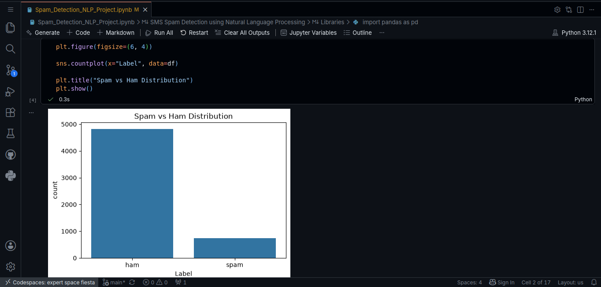
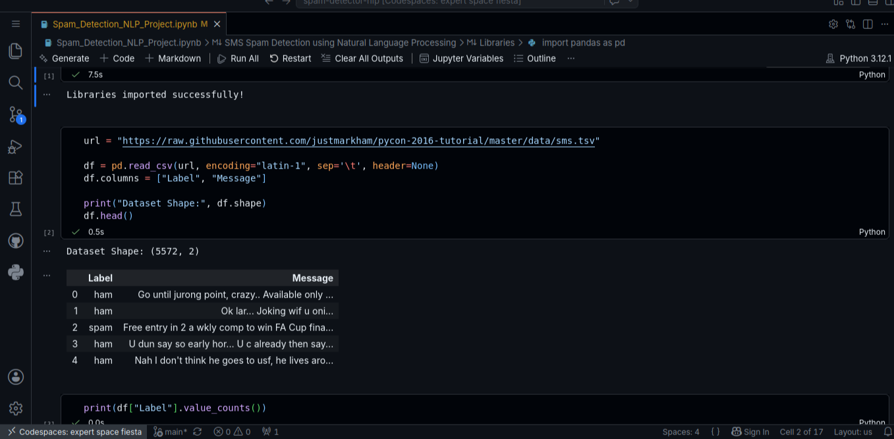
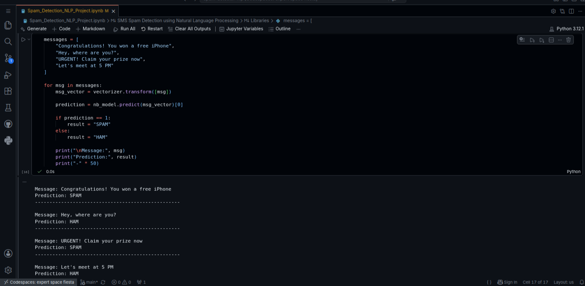

<div align="center">

# 📱 SMS Spam Detector

### An End-to-End NLP Pipeline for Intelligent Spam Classification

[](https://www.python.org/)
[](https://scikit-learn.org/)
[](https://jupyter.org/)
[](https://colab.research.google.com/)
[](LICENSE)
[]()

<br/>

> Classifying SMS messages as **Spam** or **Ham** using TF-IDF Vectorization and Machine Learning — achieving **98.21% accuracy**.

<br/>

[🚀 Run on Colab](#-how-to-run) · [📊 View Results](#-model-results) · [🔮 Roadmap](#-future-improvements)

</div>

---

## 📌 Overview

Spam messages are a persistent challenge in digital communication. This project builds a **complete NLP pipeline** that automatically identifies spam from legitimate messages — from raw text ingestion all the way to live predictions.

The pipeline converts raw SMS text into numerical features using **TF-IDF Vectorization**, then trains and compares multiple Machine Learning classifiers to find the best performer.

```
Raw SMS Text → Text Preprocessing → TF-IDF Vectorization → ML Classifier → Spam / Ham
```

---

## 📊 Dataset

> **SMS Spam Collection Dataset** — a widely used benchmark for spam classification tasks.

| Property | Value |
|---|---|
| Total Messages | 5,572 |
| ✅ Ham (Legitimate) | 4,825 |
| 🚫 Spam | 747 |
| Task Type | Binary Classification |
| Feature Engineering | TF-IDF Vectorization |

---

## 🛠️ Tech Stack

| Category | Tools |
|---|---|
| Language | Python 3.8+ |
| Data Processing | Pandas, NumPy |
| NLP & ML | Scikit-Learn |
| Visualization | Matplotlib, Seaborn |
| Environment | Google Colab / Jupyter Notebook |

---

## 🔬 NLP Pipeline

```
┌─────────────────────────────────────────────────────────────┐
│                     NLP PIPELINE                            │
│                                                             │
│  1. Data Loading → 2. EDA → 3. TF-IDF → 4. Train → 5. Eval│
└─────────────────────────────────────────────────────────────┘
```

### Stage-by-Stage Breakdown

**1️⃣ Data Loading**
- Imported the SMS Spam Collection dataset
- Inspected class distribution and raw message structure

**2️⃣ Exploratory Data Analysis (EDA)**
- Visualized Spam vs Ham class distribution
- Analyzed message length patterns across both classes

**3️⃣ Text Processing**
- Applied **TF-IDF Vectorization** to convert raw text into weighted numerical features
- Captured term importance relative to the full document corpus

**4️⃣ Model Training**
- Trained **Naive Bayes** and **Random Forest** classifiers
- Applied train/test split for unbiased evaluation

**5️⃣ Model Evaluation**
- Evaluated using Accuracy Score, Confusion Matrix, and Classification Report
- Tested on unseen, real-world style messages

---

## 📈 Visualizations

| Spam vs Ham Distribution | Message Length Analysis | Confusion Matrix |
|:---:|:---:|:---:|
|  |  |  |

---

## 🤖 Model Results

| Model | Accuracy | Notes |
|---|---|---|
| 🏆 **Naive Bayes** | **98.21%** | Best performer — ideal for text classification |
| Random Forest | 98.12% | Strong accuracy, higher compute cost |

> ✅ **Naive Bayes** was selected as the final model due to its higher accuracy and efficiency on text data.

---

## 🧪 Live Predictions

| Message | Prediction |
|---|---|
| `"Hey! How are you doing?"` | ✅ **Ham** |
| `"Congratulations! You won a free iPhone!"` | 🚫 **Spam** |
| `"Let's meet at 5 PM"` | ✅ **Ham** |
| `"URGENT! Claim your prize now!"` | 🚫 **Spam** |

---

## 💡 Key Findings

- 📏 **Spam messages are significantly longer** than ham messages on average
- 🧮 **TF-IDF effectively captures** meaningful patterns that separate spam from legitimate text
- 🎯 **Naive Bayes is naturally suited** for NLP tasks due to its probabilistic text modeling
- ✅ **High accuracy with minimal false positives** — critical for real-world spam filters

---

## 🚀 How to Run

### ▶️ Option 1 — Google Colab *(Recommended)*

1. Open `Spam_Detection_NLP_Project.ipynb` in Google Colab
2. Click `Runtime` → `Run All`
3. All dependencies are pre-installed in the Colab environment

### 💻 Option 2 — Local Setup

```bash
# 1. Clone the repository
git clone https://github.com/Saketh-dev7/spam-detector-nlp.git
cd spam-detector-nlp

# 2. Install dependencies
pip install pandas numpy matplotlib seaborn scikit-learn

# 3. Launch Jupyter Notebook
jupyter notebook
```

> Open `Spam_Detection_NLP_Project.ipynb` and run all cells sequentially.

---

## 📁 Project Structure

```
spam-detector-nlp/
│
├── 📓 Spam_Detection_NLP_Project.ipynb   ← Main notebook
├── 📊 spam_distribution.png              ← Class distribution chart
├── 📊 spam_prediction.png        ← Prediction analysis
├── 📊 spam_dataset.png               ← Dataset
└── 📄 README.md                          ← Project documentation
```

---

## 🔮 Future Improvements

- [ ] 🌥️ Word Cloud Visualization for spam vs ham vocabulary
- [ ] ✂️ Stemming and Lemmatization for better text normalization
- [ ] 🧠 Deep Learning Models (LSTM / BiLSTM)
- [ ] 🤗 Transformer Models (BERT, DistilBERT)
- [ ] 🌐 Streamlit Web App Deployment
- [ ] 📱 REST API with FastAPI

---

## 🧠 Skills Demonstrated

```
Natural Language Processing  •  TF-IDF Vectorization  •  Text Classification
Data Visualization  •  ML Model Evaluation  •  End-to-End NLP Pipeline
```

---

## 👨‍💻 Author

<div align="center">

**SAKETH**

*Machine Learning Enthusiast | Engineering Student*

[]( https://github.com/Saketh-dev7)
[](https://linkedin.com/in/sakethjakkula-dev)

<br/>

⭐ **If this project helped you, consider giving it a star!** ⭐

</div>
